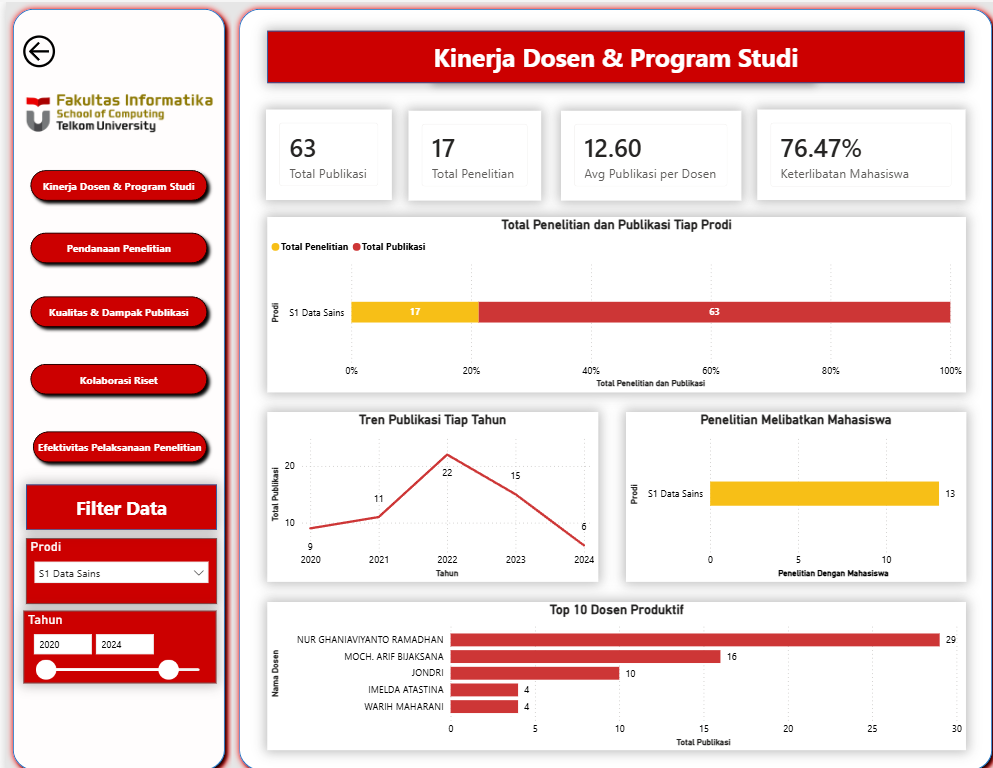

# Institutional KPI Dashboard (Research & Publication Performance)

An interactive Power BI dashboard engineered to evaluate, monitor, and optimize institutional research output, publication metrics, and funding efficiency. This dashboard serves as a strategic decision-making tool for academic institutions to track performance metrics against predefined targets across various departments and programs.

*Note: Due to data privacy policies and university regulations, the underlying source data has been omitted. The repository contains the Power BI Template (`.pbit`) showcasing the data model schema, relationships, and DAX calculations.*

---

## 🚀 Key Performance Indicators (KPIs) & Metrics

The dashboard monitors several critical operational and strategic pillars:

1. **Research & Publication Volume:** Tracking total publications, citations, and journals indexed in global databases (e.g., Scopus, Sinta).
2. **Target vs. Realization:** A dynamic visual comparison evaluating whether specific departments or program studies have met their annual publication quotas.
3. **Financial Efficiency Indicator:** Evaluating the economic impact and allocation of research grants.

### 📐 Featured DAX Formulas

Below is one of the core custom business logic measures developed for this dashboard to calculate the **Rasio Efisiensi Dana** (Fund Efficiency Ratio):

```dax
Rasio Efisiensi Dana = 
DIVIDE(
    [Total Publikasi], 
    SUM('Data Penelitian'[Total Dana Grant]), 
    0
)
```

## 🛠️ Project Structure
The project assets are organized cleanly as follows:
```daxinstitutional-kpi-dashboard/
├── institutional-kpi-dashboard.pbit  <-- Power BI Template (Data-free Schema)
├── preview.png                       <-- Dashboard UI Preview
├── .gitignore                        <-- Prevents temporary Power BI files from being tracked
└── README.md                         <-- Project documentation
```

## 💡 Key Features & Functionalities
Interactive KPI Cards: Instantly view high-level metrics with automated conditional formatting (Red/Green indicators) depending on target achievements.

Granular Slicers / Filters: Easily slice the entire report by Year (Tahun) and Program Study (Program Studi) to drill down into specific departmental performance.

Dynamic Semantic Modeling: Structured cross-filtering and relationships designed to maintain model efficiency while handling large datasets.

 ## 🖥️ Preview / Showcase


## ⚙️ How to Use this Template
Clone or download this repository:
```dax
Bash
   git clone https://github.com/Glaceel/institutional-kpi-dashboard.git
```

Open the institutional-kpi-dashboard.pbit file inside the src/ folder using Power BI Desktop.

Upon opening, Power BI will prompt you to input or connect your local database/Excel data source matching the expected data schema.

Developed as part of a Data Science Data Visualization & Analytics Group Assignment.
